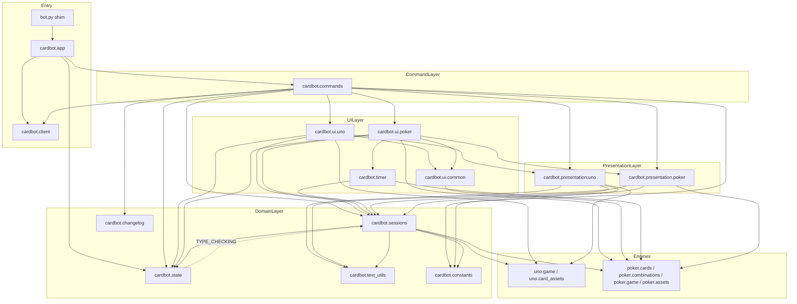
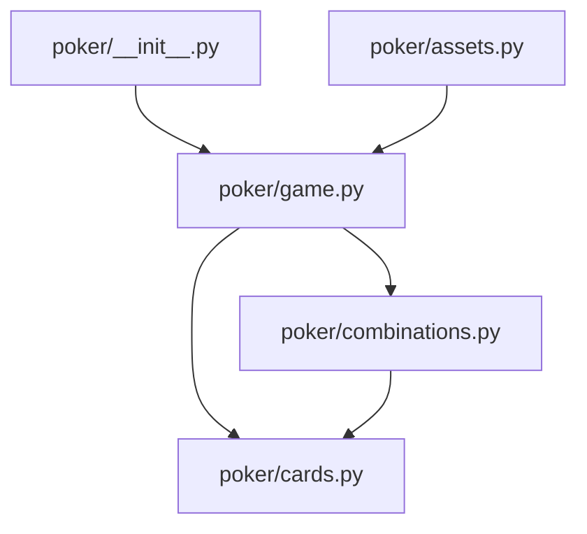

# Design Document

## Overview

Dokumen ini merancang refactor struktural untuk bot Discord permainan kartu (UNO + Remi Poker) yang saat ini terkonsentrasi pada `bot.py` (~2082 baris) sebagai "god module", dengan `poker/game.py` (~860 baris) sebagai engine besar yang masih sehat.

Tujuan tunggal refactor ini adalah **memperbaiki struktur tanpa mengubah Perilaku_Teramati sama sekali**. Tidak ada fitur baru, tidak ada perubahan aturan, tidak ada perubahan teks/embed/gambar, dan tidak ada perubahan kontrak slash command. Karena itu strategi inti desain adalah:

1. **Jaring pengaman lebih dulu.** Sebelum satu baris pun dipindah, dibuat suite *characterization test* (pytest) yang merekam keluaran engine, teks presentasi, dan parameter render gambar pada kode saat ini. Suite ini menjadi oracle: jika setelah pemindahan hasilnya berubah, test gagal.
2. **Property-based test untuk invarian engine.** Karena engine UNO dan Poker adalah logika murni dengan ruang masukan besar, properti universal (konservasi kartu, anti-simetri perbandingan, order-independence evaluasi kombinasi, kondisi error) diuji dengan Hypothesis. Ini menambah keyakinan jauh melampaui contoh tetap.
3. **Pemindahan inkremental dengan graf dependensi acyclic.** `bot.py` dipecah menjadi paket `cardbot/` berlapis. Setiap langkah pemindahan menjaga bot tetap dapat dijalankan dan suite test tetap hijau.
4. **Pemertahanan kontrak impor.** `uno/__init__.py`, `poker/__init__.py`, dan jalur impor seperti `from poker.game import PokerGame` tetap valid lewat re-export shim. Entry point `python bot.py` tidak berubah.

Temuan kunci dari pembacaan kode yang membentuk desain ini:

- **Sumber kerumitan utama** bukan algoritma melainkan pencampuran tanggung jawab di `bot.py`: konstanta, dataclass session (dengan logika scoring tournament), registry global, formatter teks/embed/visual untuk dua game, helper siklus hidup pesan Discord, logika timer asyncio, ~17 kelas `discord.ui`, setup client, event handler, ~9 slash command, dan `main()`.
- **Risiko impor melingkar nyata.** View memanggil helper siklus hidup pesan (`update_table_from_interaction`), helper itu memanggil presenter (`table_text`) dan factory view (`table_view`), dan factory view membuat instance View. Selain itu timer worker memanggil repost-message dan repost-message menjadwalkan timer. Dua siklus ini (`ui ↔ messaging` dan `timer ↔ messaging`) harus dipecahkan secara eksplisit.
- **Ketergantungan pada global modul.** Callback `discord.ui` mengacu ke global modul: registry (`sessions_by_channel`), client (`bot`), dan banyak fungsi helper. Setelah pemisahan, registry dipindah ke modul state bersama dan client diakses lewat accessor, bukan global lintas-modul.
- **Gambar bersifat non-deterministik untuk perbandingan byte.** Output JPEG bergantung pada font sistem dan kompresi, sehingga tidak boleh dibandingkan byte-per-byte. Yang dibandingkan adalah parameter render yang deterministik: dimensi kanvas, mode warna, dan nama file (Req 1.5).

## Architecture

### Prinsip Arsitektur

Arsitektur target adalah **berlapis searah (layered, one-directional)**. Aturan emasnya: dependensi hanya boleh menunjuk ke lapisan yang lebih rendah. Arah dependensi keseluruhan:

```
constants / changelog / engines  ⟸  state  ⟸  sessions  ⟸  presentation  ⟸  ui  ⟸  commands  ⟸  client/app
```

Engine murni (`uno`, `poker`) tidak tahu apa pun tentang Discord. Presentasi tahu engine tetapi tidak tahu kelas UI. UI tahu presentasi tetapi tidak tahu command. Command merakit semuanya. Lapisan client/entry hanya menyalakan bot.

### Struktur Paket Target

```
bot.py                         # Entry shim tipis: `python bot.py` tetap berfungsi (Req 6.x, 9.4)
cardbot/
  __init__.py
  constants.py                 # APP_VERSION, COLOR_CHOICES, POKER_MODE_CHOICES, POKER_TOURNAMENT_POINTS (Req 4.5)
  changelog.py                 # CHANGELOG_ENTRIES + semver_tuple/format_* (Req 4.5)
  text_utils.py                # mention(), format_tournament_round_summary() (Req 7.1)
  state.py                     # registry per-channel + accessor client (Req 4.1)
  sessions.py                  # UnoSession, PokerSession, get_*/require_*, finalize_poker_round_if_needed (Req 4.1)
  presentation/
    __init__.py
    uno.py                     # *_text / *_embed / *_visuals UNO (murni) (Req 4.2)
    poker.py                   # *_text / *_embed / *_visuals Poker + tournament_scoreboard_text (Req 4.2)
  ui/
    __init__.py
    common.py                  # reply_error (Req 4.3)
    uno.py                     # View/Select UNO + table_view + siklus hidup pesan + add_result_log (Req 4.3)
    poker.py                   # View/Select Poker + poker_table_view + siklus hidup pesan + add_poker_result_log (Req 4.3)
  timer.py                     # Layanan timer giliran Poker (asyncio murni, callback di-inject) (Req 4.4)
  client.py                    # intents, discord.Client, CommandTree (Req 4.7)
  commands.py                  # @tree.command + on_ready (Req 4.7)
  app.py                       # main() (Req 4.7)

poker/
  __init__.py                  # re-export PokerCard, PokerGame, PokerGameError (Req 6.2)
  cards.py                     # Suit/Rank, SUITS/RANKS/..., label maps, PokerCard, PokerGameError (Req 5.1)
  combinations.py              # PokerCombination, evaluate_combination, compare_combinations (Req 5.2)
  game.py                      # PokerPlayer, PokerActionResult, PokerGame, PokerStatus + re-export (Req 5.3, 6.2)
  assets.py                    # render_poker_hand_image, render_play_image (tak berubah) (Req 6.3)

uno/                           # sudah kohesif; dipertahankan apa adanya
  __init__.py                  # re-export Card, UnoGame, UnoGameError (Req 6.1)
  game.py
  card_assets.py
```

`uno/game.py` (~305 baris) sudah bersih dan kohesif, sehingga **tidak dipecah** — refactor hanya menyentuh apa yang perlu (Req mengutamakan pemecahan `bot.py` dan `poker/game.py`).

### Diagram Graf Dependensi Modul (Target)



Semua panah solid menunjuk "ke bawah" menuju leaf. Satu-satunya panah balik (`state -.-> sessions`) hanya untuk anotasi tipe di bawah `TYPE_CHECKING` / `from __future__ import annotations`, sehingga tidak menimbulkan impor runtime (Req 8.4).

### Pemecahan Tiga Siklus Dependensi (Keputusan Desain Kunci)

**Siklus 1 — `ui ↔ messaging` (View memanggil siklus hidup pesan; siklus hidup pesan membuat View).**
Resolusi: kelas View/Select, factory `table_view`, dan helper siklus hidup pesan (`repost_*`, `refresh_*`, `update_*`, `delete_*`) **diletakkan dalam satu modul per game** (`ui/uno.py`, `ui/poker.py`). Karena berada di modul yang sama, Python menyelesaikan nama saat pemanggilan (runtime), bukan saat definisi, sehingga referensi maju antar fungsi/kelas tidak menimbulkan galat impor melingkar. Ini juga kohesif: "semua tentang UI meja UNO dan cara me-render/mengirimnya" hidup berdampingan.

**Siklus 2 — `presentation → ui` lewat factory view.** Glossary mengelompokkan `*_view` ke Modul_Presentasi, tetapi factory itu harus menginstansiasi kelas View. Resolusi: **factory `table_view`/`poker_table_view` direklasifikasi ke lapisan UI** (`ui/uno.py`, `ui/poker.py`). Modul `presentation/*` menjadi **murni**: hanya menghasilkan `str`, `discord.Embed`, dan `list[discord.File]`, tanpa pernah mengimpor `ui`. Perilaku identik; hanya lokasi factory yang berpindah. Keputusan ini didokumentasikan sebagai penyimpangan sadar dari pengelompokan glossary demi graf acyclic.

**Siklus 3 — `timer ↔ messaging` (timer worker memanggil repost; repost menjadwalkan timer).**
Resolusi: **dependency injection callback**. `cardbot/timer.py` menjadi logika asyncio murni yang tidak mengimpor lapisan UI. `schedule_poker_turn_timer(session, on_timeout)` menerima coroutine callback. `ui/poker.py` menyuplai callback `_on_turn_timeout` yang melakukan `timeout_current_player`, mencatat log, repost pesan, lalu menjadwalkan ulang. Dengan ini `timer.py` hanya bergantung pada `sessions` dan engine poker (acyclic), sementara `ui/poker.py → timer` searah.

### Penanganan Ketergantungan Global Discord

`bot.py` saat ini bersandar pada beberapa global modul yang diakses langsung oleh callback UI:

| Global lama (`bot.py`) | Strategi setelah refactor |
| --- | --- |
| `sessions_by_channel`, `poker_sessions_by_channel`, `changelog_seen_versions_by_user` | Dipindah ke `cardbot/state.py` (modul state bersama). Diimpor oleh `sessions`, `ui`, `commands`. |
| `bot` (discord.Client) | `state.py` menyimpan referensi client privat dengan `set_client(client)` / `get_client()`. UI/messaging memakai `get_client().get_channel(...)`, tidak mengimpor `client.py`. Disetel sekali saat startup. |
| `tree` (CommandTree) | Tetap di `client.py`. Diimpor `commands.py` untuk dekorator `@tree.command` dan oleh `on_ready` untuk `tree.sync`. |
| `commands_synced` | Tetap sebagai flag modul di `commands.py` (tempat `on_ready` berada). |
| Helper (`reply_error`, `add_result_log`, `repost_*`, dsb.) | Dipindah bersama View dalam modul UI per game; `reply_error` (dipakai kedua game) di `ui/common.py`. |

Pemakaian `state.get_client()` membuat lapisan UI tidak bergantung pada `client.py`, memutus potensi jalur `ui → client → commands → ui`.

### Pemecahan `poker/game.py` (Req 5)



- `poker/cards.py`: tipe `Suit`/`Rank`, konstanta (`SUITS`, `RANKS`, `PLAYABLE_RANKS`, `STRAIGHT_RANKS`, `RANK_VALUES`, `PLAYABLE_RANK_VALUES`, `STRAIGHT_RANK_VALUES`, `SUIT_VALUES`, `SUIT_LABELS`, `START_THREE_PRIORITY`, `RANK_LABELS`), kelas `PokerCard`, dan `PokerGameError` (didefinisikan di lapisan terendah karena `PokerCard.playable_rank_value` dan evaluasi kombinasi sama-sama memunculkannya). (Req 5.1)
- `poker/combinations.py`: `PokerCombination`, `evaluate_combination`, `compare_combinations`, plus helper privat `_straight_key`, `_cards_label`. Mengimpor dari `cards`. (Req 5.2)
- `poker/game.py`: `PokerStatus`, `PokerPlayer`, `PokerActionResult`, `PokerGame`. Mengimpor dari `cards` dan `combinations`, lalu **me-re-export** seluruh simbol publik tingkat-modul yang sebelumnya ada di `poker/game.py` agar `from poker.game import X` tetap valid untuk `X` apa pun yang dipakai modul lain (Req 5.3, 6.2). Khususnya `from .game import PokerCard` yang dipakai `poker/assets.py` tetap berfungsi.

Tidak ada tanda tangan fungsi/kelas publik atau pesan error yang berubah (Req 5.3, 5.4).

## Components and Interfaces

### Lapisan Domain

**`cardbot/constants.py`** — Konstanta aplikasi murni. Tidak ada dependensi internal.
- `APP_VERSION: str`
- `COLOR_CHOICES: list[app_commands.Choice]`
- `POKER_MODE_CHOICES: list[app_commands.Choice]`
- `POKER_TOURNAMENT_POINTS: dict[str, int]`

**`cardbot/changelog.py`** — Data dan format changelog.
- `CHANGELOG_ENTRIES: list[dict]`
- `semver_tuple(version: str) -> tuple[int, int, int]`
- `latest_changelog_entry() -> dict[str, object]`
- `format_changelog_entry(entry: dict[str, object]) -> str`
- `format_public_changelog_entry(entry: dict[str, object], mention_everyone: bool) -> str`

**`cardbot/text_utils.py`** — Helper teks kecil yang dipakai lintas lapisan.
- `mention(user_id: int) -> str`
- `format_tournament_round_summary(round_number: int, round_points: list[tuple[int, int]]) -> str` — dipindah ke sini (bukan presentasi) karena dipanggil oleh `PokerSession.score_finished_tournament_round`; meletakkannya di leaf `text_utils` mencegah siklus `sessions ↔ presentation`.

**`cardbot/state.py`** — State global proses dan accessor client.
- `sessions_by_channel: dict[int, "UnoSession"]`
- `poker_sessions_by_channel: dict[int, "PokerSession"]`
- `changelog_seen_versions_by_user: dict[int, str]`
- `set_client(client: discord.Client) -> None`
- `get_client() -> discord.Client`
- Tipe session hanya dirujuk via `TYPE_CHECKING` (tanpa impor runtime).

**`cardbot/sessions.py`** — Dataclass session + lookup/validasi.
- `class UnoSession` dan `class PokerSession` (lihat Data Models).
- `require_channel_id(interaction) -> int`
- `get_session(channel_id: int | None) -> UnoSession`
- `get_poker_session(channel_id: int | None) -> PokerSession`
- `require_session_player(session: UnoSession, user_id: int) -> None`
- `require_poker_player(session: PokerSession, user_id: int) -> None`
- `finalize_poker_round_if_needed(session: PokerSession) -> None` — logika sesi murni (tanpa Discord), dipanggil oleh lapisan messaging.

### Lapisan Presentasi (Murni)

**`cardbot/presentation/uno.py`** — Membentuk teks/embed/visual UNO. Menerima `UnoSession`/`UnoGame`, mengembalikan `str` / `discord.Embed` / `(embed, files)`. Tidak mengimpor `ui`.
- `lobby_text`, `public_state_text`, `finished_text`, `table_text`, `hand_text` → `str`
- `rules_embed() -> discord.Embed`
- `table_visuals(session) -> tuple[discord.Embed | None, list[discord.File]]`
- `hand_visuals(game, user_id, page=0, page_size=25) -> tuple[discord.Embed, list[discord.File]]`

**`cardbot/presentation/poker.py`** — Setara untuk Poker.
- `poker_lobby_text`, `poker_state_text`, `poker_finished_text`, `poker_table_text`, `poker_hand_text` → `str`
- `tournament_scoreboard_text(session) -> str`
- `poker_rules_embed() -> discord.Embed`
- `poker_table_visuals(session) -> tuple[discord.Embed | None, list[discord.File]]`
- `poker_hand_visuals(game, user_id, page=0, page_size=25, selected_numbers=None) -> tuple[discord.Embed, list[discord.File]]`

### Lapisan UI

**`cardbot/ui/common.py`**
- `reply_error(interaction, error) -> None` (memilih prefix "Remi Poker"/"UNO" sesuai tipe error).

**`cardbot/ui/uno.py`** — View/Select UNO + factory + siklus hidup pesan.
- Factory: `table_view(session) -> discord.ui.View`
- Siklus hidup: `refresh_table_message`, `repost_table_message`, `delete_table_message`, `update_table_from_interaction`, `add_result_log`
- View: `LobbyView`, `FinishedView`, `GameView`, `CardSelect`, `ChallengeTargetSelect`, `ChallengeUnoView`, `HandView`, `ColorPickView`
- Memakai `state.get_client()` untuk mengirim/menghapus pesan.

**`cardbot/ui/poker.py`** — View/Select Poker + factory + siklus hidup pesan + integrasi timer.
- Factory: `poker_table_view(session) -> discord.ui.View`
- Siklus hidup: `refresh_poker_table_message`, `repost_poker_table_message`, `delete_poker_table_message`, `update_poker_table_from_interaction`, `add_poker_result_log`
- Callback timer: `_on_turn_timeout(session)` yang disuplai ke `timer.schedule_poker_turn_timer`
- View: `PokerTimerSelect`, `PokerModeSelect`, `PokerTournamentRoundSelect`, `PokerLobbyView`, `PokerFinishedView`, `PokerTournamentRoundFinishedView`, `PokerGameView`, `PokerCardSelect`, `PokerHandView`

### Lapisan Layanan Timer

**`cardbot/timer.py`** — Logika timer giliran Poker, asyncio murni dengan callback injeksi (Req 4.4).
- `cancel_poker_turn_timer(session) -> None`
- `schedule_poker_turn_timer(session, on_timeout: Callable[["PokerSession"], Awaitable[None]]) -> None`
- `poker_turn_timer_worker(session, token, expected_user_id, on_timeout) -> None`

Tidak mengimpor `ui`/`presentation`; menjaga logika debounce token (`turn_timer_token`) dan pembatalan task identik dengan perilaku saat ini.

### Lapisan Client / Command / Entry

**`cardbot/client.py`** — `intents`, `bot = discord.Client(intents=...)`, `tree = app_commands.CommandTree(bot)`. Tanpa dependensi paket internal.

**`cardbot/commands.py`** — Seluruh `@tree.command` dan `on_ready`. Mengimpor presentasi, ui, sessions, changelog, constants, state, dan `bot`/`tree` dari client. Flag `commands_synced` tinggal di sini.
- `on_ready`, `uno_start`, `changelog`, `publish_changelog`, `uno_hand`, `uno_status`, `uno_play`, `poker_start`, `poker_hand`, `poker_status`.

**`cardbot/app.py`** — `main()`: memuat env, `state.set_client(bot)`, mengimpor `commands` (agar dekorator terdaftar), lalu `bot.run(token)`.

**`bot.py` (root)** — Shim tipis untuk mempertahankan `python bot.py` (Req 9.4):
```python
from cardbot.app import main

if __name__ == "__main__":
    main()
```

### Kontrak Impor yang Dipertahankan (Req 6)

| Jalur impor | Status |
| --- | --- |
| `from uno import Card, UnoGame, UnoGameError` | Dipertahankan (`uno/__init__.py` tak berubah) |
| `from poker import PokerCard, PokerGame, PokerGameError` | Dipertahankan (`poker/__init__.py` tak berubah) |
| `from poker.game import PokerGame, PokerGameError, PokerStatus, PokerCard, ...` | Dipertahankan via re-export di `poker/game.py` |
| `from poker.assets import render_poker_hand_image, render_play_image` | Tak berubah |
| `from uno.card_assets import render_card_image, render_hand_image` | Tak berubah |
| `render_card_image`, `render_hand_image`, `render_poker_hand_image`, `render_play_image` | Tanda tangan tak berubah (Req 6.3) |

## Data Models

### Model Engine (Tidak Berubah)

Dataclass dan enum engine dipertahankan persis, hanya berpindah berkas:

- **UNO** (`uno/game.py`, tetap): `Card(color, value)`, `Player`, `PlayResult`, `GameStatus`, `UnoGame`, konstanta `COLORS`/`COLOR_LABELS`.
- **Poker** — `PokerCard(rank, suit)` → `poker/cards.py`; `PokerCombination`, fungsi evaluasi → `poker/combinations.py`; `PokerPlayer`, `PokerActionResult`, `PokerStatus`, `PokerGame` → `poker/game.py`.

### Model Session (Berpindah ke `cardbot/sessions.py`, Logika Tak Berubah)

**`UnoSession`**

| Field | Tipe | Catatan |
| --- | --- | --- |
| `channel_id` | `int` | |
| `owner_id` | `int` | |
| `game` | `UnoGame` | default factory |
| `table_message_id` | `int \| None` | id pesan panel meja |
| `log` | `list[str]` | hanya 3 aksi terakhir |
| `end_game_votes` | `set[int]` | |

Metode/properti: `add_log`, `end_vote_required`, `end_vote_count`, `add_end_vote`.

**`PokerSession`** — menyertakan logika scoring tournament:

| Field | Tipe | Catatan |
| --- | --- | --- |
| `channel_id`, `owner_id` | `int` | |
| `mode` | `str` | `"regular"` / `"tournament"` |
| `tournament_total_rounds` | `int` | default 3 |
| `tournament_current_round` | `int` | |
| `tournament_scores` | `dict[int, int]` | |
| `tournament_round_summaries` | `list[str]` | |
| `tournament_scored_rounds` | `set[int]` | |
| `tournament_aborted` | `bool` | |
| `game` | `PokerGame` | |
| `table_message_id` | `int \| None` | |
| `log` | `list[str]` | 5 terakhir |
| `end_game_votes` | `set[int]` | |
| `timer_seconds` | `int` | default 45 |
| `turn_timer_task` | `asyncio.Task \| None` | tidak di-repr |
| `turn_timer_token` | `int` | token debounce |

Metode/properti: `add_log`, `end_vote_required`, `end_vote_count`, `add_end_vote`, `is_tournament`, `tournament_finished`, `tournament_between_rounds`, `start_poker_round`, `start_next_tournament_round`, `score_finished_tournament_round`. Logika scoring (point first/second/middle/loser dan kasus bomb +40/-40) dipertahankan identik (Req 1.3).

### Peta Pemindahan Simbol (Sumber Kebenaran Refactor)

| Simbol lama di `bot.py` | Lokasi baru |
| --- | --- |
| `APP_VERSION`, `COLOR_CHOICES`, `POKER_MODE_CHOICES`, `POKER_TOURNAMENT_POINTS` | `cardbot/constants.py` |
| `CHANGELOG_ENTRIES`, `semver_tuple`, `latest_changelog_entry`, `format_changelog_entry`, `format_public_changelog_entry` | `cardbot/changelog.py` |
| `mention`, `format_tournament_round_summary` | `cardbot/text_utils.py` |
| `sessions_by_channel`, `poker_sessions_by_channel`, `changelog_seen_versions_by_user`, accessor `bot` | `cardbot/state.py` |
| `UnoSession`, `PokerSession`, `get_session`, `get_poker_session`, `require_session_player`, `require_poker_player`, `require_channel_id`, `finalize_poker_round_if_needed` | `cardbot/sessions.py` |
| `lobby_text`, `public_state_text`, `finished_text`, `table_text`, `hand_text`, `rules_embed`, `table_visuals`, `hand_visuals` | `cardbot/presentation/uno.py` |
| `poker_lobby_text`, `poker_state_text`, `poker_finished_text`, `poker_table_text`, `poker_hand_text`, `poker_rules_embed`, `poker_table_visuals`, `poker_hand_visuals`, `tournament_scoreboard_text` | `cardbot/presentation/poker.py` |
| `reply_error` | `cardbot/ui/common.py` |
| `table_view`, `refresh_table_message`, `repost_table_message`, `delete_table_message`, `update_table_from_interaction`, `add_result_log`, semua View/Select UNO | `cardbot/ui/uno.py` |
| `poker_table_view`, `refresh_poker_table_message`, `repost_poker_table_message`, `delete_poker_table_message`, `update_poker_table_from_interaction`, `add_poker_result_log`, semua View/Select Poker | `cardbot/ui/poker.py` |
| `cancel_poker_turn_timer`, `schedule_poker_turn_timer`, `poker_turn_timer_worker` | `cardbot/timer.py` |
| `intents`, `bot`, `tree` | `cardbot/client.py` |
| `on_ready`, `commands_synced`, semua `@tree.command` | `cardbot/commands.py` |
| `main`, `if __name__ == "__main__"` | `cardbot/app.py` + `bot.py` (shim) |
| `Suit/Rank`, konstanta poker, `PokerCard`, `PokerGameError` | `poker/cards.py` |
| `PokerCombination`, `evaluate_combination`, `compare_combinations`, `_straight_key`, `_cards_label` | `poker/combinations.py` |
| `PokerStatus`, `PokerPlayer`, `PokerActionResult`, `PokerGame` (+ re-export) | `poker/game.py` |

## Correctness Properties

*Sebuah properti adalah karakteristik atau perilaku yang harus selalu benar untuk semua eksekusi valid sistem — pada dasarnya pernyataan formal tentang apa yang harus dilakukan sistem. Properti menjadi jembatan antara spesifikasi yang dapat dibaca manusia dan jaminan kebenaran yang dapat diverifikasi mesin.*

Properti berikut diturunkan dari prework di atas. Hanya kriteria yang diklasifikasikan PROPERTY yang menjadi properti berbasis Hypothesis. Kriteria EXAMPLE/EDGE_CASE/SMOKE ditangani oleh characterization test dan smoke test (lihat Testing Strategy). Penting: properti ini memvalidasi bahwa **logika engine tetap utuh** — engine adalah target refactor yang paling berisiko untuk perubahan perilaku tak sengaja, sehingga properti memberi keyakinan terukur sesuai Req 3.

### Property 1: Konservasi total kartu UNO

*Untuk setiap* permainan UNO yang dimulai dengan jumlah pemain valid dan dijalankan dengan rangkaian aksi legal acak (play, draw, pass, call UNO, challenge), jumlah total kartu pada gabungan seluruh tangan pemain, deck, dan discard pile harus selalu tetap konstan dan sama dengan ukuran deck awal (108).

**Validates: Requirements 3.1**

### Property 2: Indeks giliran UNO selalu dalam rentang valid

*Untuk setiap* permainan UNO yang sedang berjalan, setelah berapa pun perpindahan giliran akibat aksi legal acak, `turn_index` harus selalu memenuhi `0 <= turn_index < len(players)`.

**Validates: Requirements 3.4**

### Property 3: Anti-simetri perbandingan kombinasi Poker

*Untuk setiap* pasangan kombinasi Poker valid `(a, b)` dengan pola yang sama, hasil perbandingan harus anti-simetris: `sign(compare_combinations(a, b)) == -sign(compare_combinations(b, a))`, dan `compare_combinations(a, a) == 0` untuk kombinasi mana pun.

**Validates: Requirements 3.2**

### Property 4: Evaluasi kombinasi tidak bergantung urutan kartu masukan

*Untuk setiap* himpunan kartu valid yang membentuk sebuah kombinasi, mengevaluasi kombinasi atas permutasi urutan kartu mana pun harus menghasilkan `kind`, `pattern`, dan `rank_key` yang identik.

**Validates: Requirements 3.3**

### Property 5: Himpunan kartu tak valid memunculkan error

*Untuk setiap* himpunan kartu (tanpa kartu rank "3") yang tidak membentuk kombinasi valid mana pun, `evaluate_combination` harus memunculkan `PokerGameError`.

**Validates: Requirements 3.5**

### Property 6: Kartu rank "3" pada evaluasi memunculkan error

*Untuk setiap* himpunan kartu yang memuat minimal satu kartu rank "3", `evaluate_combination` harus memunculkan `PokerGameError`.

**Validates: Requirements 3.6**

### Property 7: Parameter render gambar konsisten dengan formula tata letak

*Untuk setiap* himpunan kartu valid (UNO maupun Poker) dan nomor halaman valid, fungsi render (`render_hand_image`, `render_poker_hand_image`) harus mengembalikan `(BytesIO, filename)` yang menghasilkan gambar dapat dibuka Pillow dengan mode `"RGB"` dan dimensi kanvas yang sesuai formula tata letak (jumlah kolom = `min(5, jumlah_kartu_tampil)`, jumlah baris dihitung dari kolom, serta padding/gap/thumbnail tetap), tanpa galat.

**Validates: Requirements 1.5, 7.3**

## Error Handling

Refactor ini **tidak mengubah satu pun perilaku error** (Req 1.6, 5.4). Strategi penanganan error dipertahankan apa adanya, hanya berpindah lokasi:

1. **Error domain engine.** `UnoGameError` dan `PokerGameError` tetap dimunculkan oleh engine dengan teks bahasa Indonesia yang identik. `PokerGameError` dipindah ke `poker/cards.py` (lapisan terendah) dan di-re-export dari `poker/game.py` serta `poker/__init__.py` agar `isinstance(e, PokerGameError)` dan `except PokerGameError` di seluruh kode tetap berfungsi tanpa perubahan.

2. **Penerjemahan error ke pengguna.** `reply_error` (di `cardbot/ui/common.py`) tetap memilih prefix `"Remi Poker"` untuk `PokerGameError` dan `"UNO"` untuk lainnya, lalu mengirim ephemeral lewat `interaction.response`/`followup` sesuai keadaan `is_done()`. Logika percabangan dipertahankan persis.

3. **Error siklus hidup pesan Discord.** Penangkapan `discord.Forbidden`/`discord.HTTPException`/`discord.NotFound` pada `delete_*_message`, serta penanganan `TimeoutError`/`discord.Forbidden`/`discord.HTTPException` pada `publish_changelog`, dipindah utuh.

4. **Error timer.** `poker_turn_timer_worker` tetap menangani `asyncio.CancelledError` (return diam) dan `PokerGameError` (mencatat "Timer gagal: ..." lalu repost). Karena callback kini di-inject, blok try/except tetap berada di worker dengan struktur sama.

5. **Validasi guard.** `require_channel_id`, `get_session`/`get_poker_session` (pesan "Belum ada meja ..."), dan `require_*_player` mempertahankan teks dan kondisi pemicu yang sama.

Penanganan error diverifikasi oleh: properti error (Property 5, 6), edge-case test untuk pesan spesifik (Req 1.6/5.4), dan characterization test alur yang melatih jalur guard.

## Testing Strategy

Strategi pengujian berlapis dan **dijalankan lebih dulu pada kode sebelum refactor** untuk menetapkan baseline hijau (Req 2.6), lalu dijalankan ulang setelah tiap langkah pemindahan (Req 9.1, 9.3).

### Tooling

- **Framework**: `pytest` dijalankan dari satu perintah di root: `pytest` (Req 2.1). Tambahkan `pytest` dan `hypothesis` ke `requirements.txt` (atau `requirements-dev.txt`) sebagai dependensi pengembangan.
- **Property-based testing**: **Hypothesis** (pustaka PBT standar untuk Python). Engine **tidak** mengimplementasikan PBT dari nol.
- **Lokasi test**: direktori `tests/` di root, dengan submodul: `tests/test_uno_engine.py`, `tests/test_poker_engine.py`, `tests/test_presentation.py`, `tests/test_render.py`, `tests/test_contracts.py` (importability/signature/docstring), dan `tests/properties/` untuk property test.
- **Determinisme**: setiap characterization test memanggil `random.seed(<seed tetap>)` sebelum aksi acak engine, via fixture bersama, agar shuffle deck dan deal reprodusibel (Req 2.5). Property test menggunakan generator Hypothesis dan tidak bergantung pada seed global.

### Pendekatan Ganda

**Characterization / example test (jaring pengaman utama, Req 2):**
- Alur inti UNO ber-seed: start, play kartu (termasuk wild + pilih warna, skip, reverse, +2, +4), draw, pass, call UNO, challenge UNO. Rekam `PlayResult.public_messages` dan ringkasan `public_state()` sebagai golden (Req 2.2).
- Alur inti Poker ber-seed: start (termasuk penentuan first turn & pembuangan kartu 3), play kombinasi tiap pola, pass, auto-skip pair/triple, fase adu bomb, penentuan winner/loser, dan scoring tournament (point first/second/middle/loser serta kasus bomb +40/-40) (Req 2.3, 1.3).
- Presentasi: golden string untuk minimal satu state lobby, satu state berjalan, dan satu state selesai pada UNO dan Poker (Req 2.4, 1.4). Karena pesan memuat `mention(user_id)`, dipakai user_id tetap agar string deterministik.
- Snapshot command: nama, deskripsi, dan parameter setiap slash command lewat introspeksi `tree` (Req 1.1) tanpa koneksi Discord.

**Property test (keyakinan terukur engine, Req 3):**
- Mengimplementasikan Property 1–7. Setiap properti = **satu** test berbasis Hypothesis.
- **Minimum 100 iterasi** per properti (`@settings(max_examples=100)` atau lebih).
- Generator: strategi Hypothesis untuk kartu/tangan/kombinasi Poker dan untuk rangkaian aksi UNO legal acak. Generator menangani edge case yang disebut requirement (mis. kartu 3 untuk Property 6, himpunan tak valid untuk Property 5, reshuffle deck untuk Property 1).
- **Tag** tiap property test dengan komentar yang merujuk properti desain, format: `# Feature: clean-code-refactor, Property {number}: {property_text}`.

**Smoke / contract test (struktur & kontrak, Req 4–9):**
- Importability: impor setiap modul (`cardbot.*`, `uno.*`, `poker.*`) tanpa `ImportError`/`SyntaxError` (Req 8.2, 9.2), termasuk impor terisolasi untuk membuktikan tidak ada circular import (Req 8.4).
- Kontrak paket: `from uno import Card, UnoGame, UnoGameError` dan `from poker import PokerCard, PokerGame, PokerGameError` berhasil (Req 6.1, 6.2); `from poker.game import ...` untuk simbol publik tetap valid (Req 5.3).
- Signature snapshot: `inspect.signature` untuk fungsi render publik dan simbol engine kunci tidak berubah (Req 6.3, 5.3).
- Docstring: modul baru memiliki `__doc__` non-kosong (Req 8.3).
- Entry point: `cardbot.app.main` callable dan `bot.py` shim memanggilnya (Req 4.7, 9.4).

### Keseimbangan

Property test menanggung cakupan input luas untuk invarian engine; characterization test menjaga kesetaraan byte/string perilaku before/after; smoke test menjaga kontrak struktural. Hindari menambah unit test berlebihan yang sudah tercakup oleh property test — unit/example test difokuskan pada contoh konkret, titik integrasi, dan kasus error spesifik (pesan bahasa Indonesia).

### Urutan Migrasi yang Menjaga Bot Selalu Dapat Dijalankan

Setiap langkah diakhiri dengan menjalankan `pytest` (harus hijau) sebelum lanjut (Req 9.3):

1. **Tambah tooling + tulis seluruh test terhadap kode lama.** Tetapkan baseline hijau (Req 2.6). Snapshot/golden direkam dari `bot.py` yang belum dipecah.
2. **Pecah leaf engine Poker**: `poker/cards.py` → `poker/combinations.py`, lalu ramping `poker/game.py` dengan re-export. Jalankan test.
3. **Ekstrak lapisan domain**: `constants.py`, `changelog.py`, `text_utils.py`, `state.py`, `sessions.py`. Sementara `bot.py` mengimpor balik dari modul baru. Jalankan test.
4. **Ekstrak presentasi murni**: `presentation/uno.py`, `presentation/poker.py`. Jalankan test.
5. **Ekstrak timer** (`timer.py`) dengan callback injeksi. Jalankan test.
6. **Ekstrak UI** (`ui/common.py`, `ui/uno.py`, `ui/poker.py`) termasuk factory view dan siklus hidup pesan. Jalankan test.
7. **Ekstrak client/commands/app** dan ubah `bot.py` menjadi shim tipis. Jalankan test + verifikasi importability penuh dan entry point.
8. **Penyatuan duplikasi aman** (Req 7) sebagai langkah terakhir, dijaga golden presentasi/render. Batalkan penyatuan apa pun yang mengubah golden (Req 7.2).
